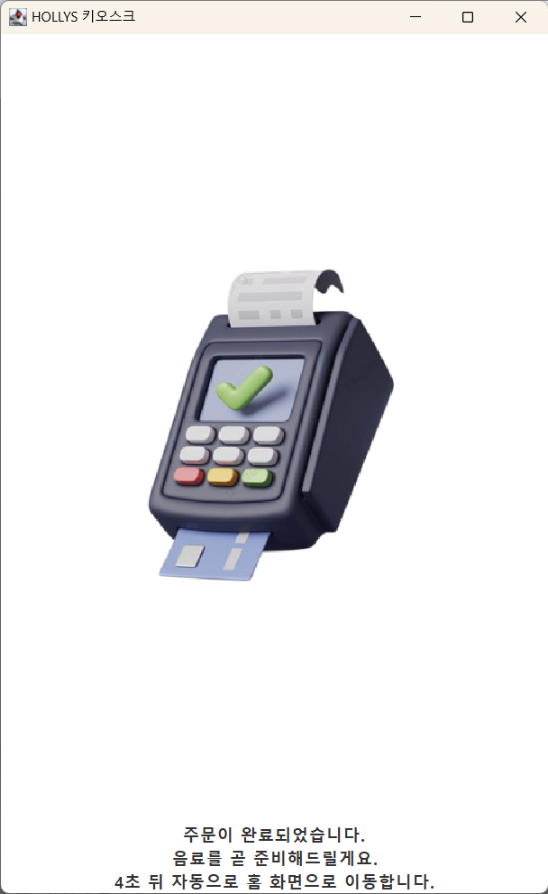

# ☕ Java Cafe Kiosk (OOP Final Project)

A Java Swing-based self-ordering kiosk application for a cafe.  
This project was developed as a final assignment for the Object-Oriented Programming and Practice course at University of Seoul.

  

---

## 📚 Course Information

- **Course Name**: Object-Oriented Programming and Practice (객체지향프로그래밍 및 실습)
- **University**: University of Seoul (서울시립대학교)
- **Semester**: Spring 2024
- **Project Type**: Final Team Project — Java Kiosk Application

---

## 🧩 Features

- **Tabbed Interface**: Switch between Coffee / Non-Coffee / Food categories using `JTabbedPane`
- **Order System**
  - Add or subtract item quantity using `+` / `-` / "Add to Cart" buttons
  - View detailed order list using `JTable` and `TextArea`
  - Automatically calculates the total amount
- **Payment System**
  - Choose payment method: Card or Mobile Voucher
  - Displays confirmation message on successful payment
  - Shows warning if no item is selected (₩0 order)

---

## 🎨 Tech Stack

- **Language**: Java
- **IDE**: Eclipse
- **UI**: Swing (`JTabbedPane`, `JButton`, `JTable`, `TextArea`, etc.)
- **Architecture**: Object-Oriented Programming (separated by class files)

---

## 🖼️ UI Preview

| Main Screen | Order Table | Payment Screen |
|-------------|-------------|----------------|
|  |  |  |

---

## 🎥 Demo Video

[▶️ Watch on YouTube]( https://www.youtube.com/watch?v=3Gxk6OycxUA)  
> demo video link 

---

## 🙋‍♀️ My Contribution

- Designed UI layout and interaction flow
- Implemented core logic in `Menu.java`
- Handled error fixing and program debugging
- Wrote functional documentation and specifications

